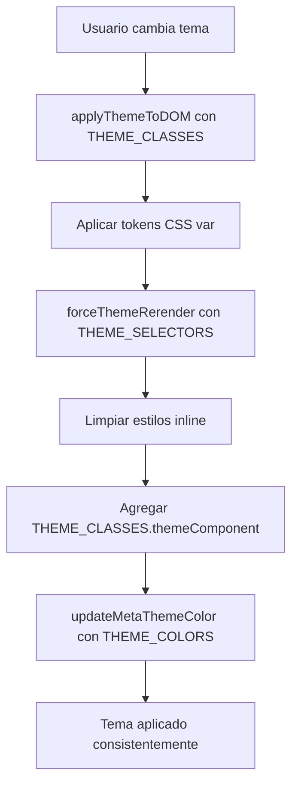

# Arquitectura BEM-Like para Sistema de Temas

## Filosofía de Diseño

La solución implementada sigue estrictamente los principios BEM-like y utiliza tokens de diseño para mantener consistencia y facilitar el mantenimiento.

## Estructura de Archivos

```
src/
├── utils/
│   ├── themeInitializer.ts      # Lógica de inicialización
│   └── themeConstants.ts        # Tokens y constantes (NUEVO)
├── styles/
│   ├── theme-fix.css           # CSS BEM-like con tokens
│   └── design-system/
│       └── color-palette.css   # Tokens CSS existentes
└── hooks/
    └── useSystemTheme.ts       # Hook para sincronización
```

## Tokens de Diseño (Design Tokens)

### Archivo: `src/utils/themeConstants.ts`

#### Colores del Sistema
```typescript
export const THEME_COLORS = {
  light: {
    metaThemeColor: '#ffffff',
    bgPrimary: '#f9fafb',
    bgSecondary: '#ffffff',
    textPrimary: '#111827',
    // ...
  },
  dark: {
    metaThemeColor: '#1f2937',
    bgPrimary: '#111827',
    bgSecondary: '#1f2937',
    textPrimary: '#ffffff',
    // ...
  },
} as const;
```

#### Clases BEM-Like
```typescript
export const THEME_CLASSES = {
  light: 'light',
  dark: 'dark',
  themeComponent: 'theme-component',
  themeIcon: 'theme-icon',
  headerRedesigned: 'header-redesigned',
  // ...
} as const;
```

#### Variables CSS
```typescript
export const THEME_CSS_VARS = {
  themeMode: '--theme-mode',
  themeForceUpdate: '--theme-force-update',
  themeBgPrimary: '--theme-bg-primary',
  // ...
} as const;
```

## Arquitectura CSS BEM-Like

### Archivo: `src/styles/theme-fix.css`

#### Tokens CSS
```css
/* Light theme tokens */
html.light {
  --theme-mode: 'light';
  --theme-bg-primary: var(--gray-50);
  --theme-bg-secondary: #ffffff;
  --theme-text-primary: var(--gray-900);
  --theme-icon-color: currentColor;
}

/* Dark theme tokens */
html.dark {
  --theme-mode: 'dark';
  --theme-bg-primary: var(--gray-900);
  --theme-bg-secondary: var(--gray-800);
  --theme-text-primary: #ffffff;
  --theme-icon-color: #ffffff;
}
```

#### Componentes BEM-Like
```css
/* Header component theme consistency */
.header-redesigned {
  background-color: var(--theme-bg-secondary) !important;
  border-color: var(--theme-border-primary) !important;
  color: var(--theme-text-primary) !important;
}

.header-redesigned__title,
.header-redesigned__username {
  color: var(--theme-text-primary) !important;
}

/* Side menu component theme consistency */
.header-side-menu {
  background-color: var(--theme-bg-secondary) !important;
  color: var(--theme-text-primary) !important;
}
```

## Beneficios del Enfoque BEM-Like

### 1. Separación de Responsabilidades
- **HTML/JSX**: Solo clases semánticas BEM-like
- **CSS**: Todos los estilos en archivos dedicados
- **JavaScript**: Lógica de tema usando constantes tipadas

### 2. Mantenibilidad
```typescript
// ❌ Antes: Valores hardcodeados
htmlElement.classList.add('dark');
metaThemeColor.setAttribute('content', '#1f2937');

// ✅ Después: Tokens centralizados
htmlElement.classList.add(THEME_CLASSES.dark);
metaThemeColor.setAttribute('content', THEME_COLORS.dark.metaThemeColor);
```

### 3. Consistencia Visual
```css
/* ❌ Antes: Colores hardcodeados */
.header-redesigned {
  background-color: #ffffff;
  color: #1f2937;
}

/* ✅ Después: Tokens del sistema */
.header-redesigned {
  background-color: var(--theme-bg-secondary);
  color: var(--theme-text-primary);
}
```

### 4. Type Safety
```typescript
// Tipos estrictos para prevenir errores
type ThemeMode = 'light' | 'dark';
type ThemeColorKey = keyof typeof THEME_COLORS.light;
type ThemeClassName = keyof typeof THEME_CLASSES;
```

## Nomenclatura BEM-Like

### Bloques (Componentes)
```css
.header-redesigned { }
.header-side-menu { }
.module-card { }
.nav-btn { }
```

### Elementos (Partes del componente)
```css
.header-redesigned__title { }
.header-redesigned__username { }
.header-side-menu__text { }
.module-card__icon { }
```

### Modificadores (Estados/variantes)
```css
.theme-component { }
.theme-icon { }
.theme-transition { }
```

## Selectores Semánticos

### Archivo: `src/utils/themeConstants.ts`
```typescript
export const THEME_SELECTORS = {
  // Elementos con estilos inline problemáticos
  inlineColorElements: '[style*="color"], [style*="stroke"], [style*="fill"]',
  
  // Elementos SVG que necesitan tema
  svgElements: '.header-redesigned svg, .header-side-menu svg, .module-card svg',
  
  // Componentes que necesitan clase theme-component
  themeComponents: '.header-redesigned, .header-side-menu, .module-card',
} as const;
```

## Flujo de Aplicación de Tema



## Ventajas del Sistema

### Para Desarrolladores
1. **Autocompletado**: TypeScript sugiere clases y colores válidos
2. **Refactoring seguro**: Cambios centralizados en constantes
3. **Debugging fácil**: Nombres semánticos en lugar de valores mágicos
4. **Testing robusto**: Constantes reutilizables en tests

### Para Diseñadores
1. **Tokens centralizados**: Un solo lugar para cambiar colores
2. **Consistencia garantizada**: Imposible usar colores no definidos
3. **Escalabilidad**: Fácil agregar nuevos temas o componentes
4. **Documentación viva**: Los tokens son autodocumentados

### Para Usuarios
1. **Rendimiento**: Menos recálculos CSS innecesarios
2. **Consistencia**: Todos los elementos respetan el tema
3. **Accesibilidad**: Respeta `prefers-reduced-motion`
4. **Responsive**: Funciona correctamente en móviles

## Extensibilidad

### Agregar Nuevo Tema
```typescript
// 1. Agregar en themeConstants.ts
export const THEME_COLORS = {
  light: { /* ... */ },
  dark: { /* ... */ },
  sepia: {  // NUEVO
    metaThemeColor: '#f4f1e8',
    bgPrimary: '#f4f1e8',
    // ...
  },
} as const;

// 2. Agregar tokens CSS en theme-fix.css
html.sepia {
  --theme-mode: 'sepia';
  --theme-bg-primary: var(--sepia-50);
  /* ... */
}
```

### Agregar Nuevo Componente
```typescript
// 1. Agregar clase en THEME_CLASSES
export const THEME_CLASSES = {
  // ...
  newComponent: 'new-component',
} as const;

// 2. Agregar selector en THEME_SELECTORS
export const THEME_SELECTORS = {
  // ...
  themeComponents: '..., .new-component',
} as const;

// 3. Agregar CSS BEM-like
.new-component {
  background-color: var(--theme-bg-secondary);
  color: var(--theme-text-primary);
}
```

## Testing

Los tests verifican el uso correcto de constantes:

```typescript
import { THEME_CLASSES, THEME_COLORS } from '../../src/utils/themeConstants';

expect(mockClassList.add).toHaveBeenCalledWith(THEME_CLASSES.dark);
expect(mockSetAttribute).toHaveBeenCalledWith('content', THEME_COLORS.dark.metaThemeColor);
```

## Próximos Pasos

1. **Migración gradual**: Convertir componentes existentes a usar tokens
2. **Más temas**: Implementar tema sepia, alto contraste, etc.
3. **Animaciones**: Tokens para duraciones y easings de transiciones
4. **Responsive**: Tokens para breakpoints y espaciado