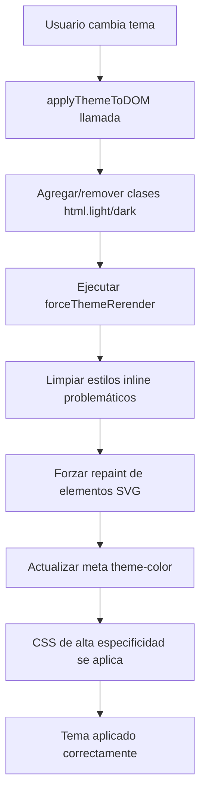

# Solución a Conflictos de CSS en Cambio de Tema

## Problema Identificado

Cuando el usuario cambiaba de modo dark a light, algunos elementos mantenían estilos de modo dark debido a:

1. **Conflictos de especificidad CSS**: Reglas con `!important` que sobrescribían el comportamiento normal
2. **Estilos inline persistentes**: Elementos con estilos inline que no se limpiaban al cambiar tema
3. **Falta de clase `light` explícita**: Solo se usaba la ausencia de `dark`, no una clase positiva
4. **Reglas CSS globales agresivas**: Selectores muy específicos que impedían el cambio correcto

## Análisis de Conflictos Encontrados

### Reglas Problemáticas en `src/styles/components.css`:

```css
/* Estas reglas eran demasiado agresivas */
.dark svg {
  color: #ffffff !important;
  stroke: #ffffff !important;
  fill: none !important;
}

svg {
  color: currentColor !important;
  stroke: currentColor !important;
  fill: none !important;
}
```

### Elementos Afectados:
- Iconos SVG (Lucide React)
- Header y menú lateral
- Botones y controles
- Modales y formularios
- Cards de módulos

## Solución Implementada

### 1. Sistema de Clases Explícitas

**Antes:**
```html
<html class="dark"> <!-- Solo para dark -->
<html> <!-- Sin clase para light -->
```

**Después:**
```html
<html class="dark"> <!-- Para dark -->
<html class="light"> <!-- Explícito para light -->
```

### 2. CSS de Mayor Especificidad

**Archivo: `src/styles/theme-fix.css`**

```css
/* Especificidad más alta que las reglas globales */
html.light svg,
html.light [data-lucide] {
  color: currentColor !important;
  stroke: currentColor !important;
}

html.dark svg,
html.dark [data-lucide] {
  color: #ffffff !important;
  stroke: #ffffff !important;
}
```

### 3. Limpieza de Estilos Inline

**Función: `forceThemeRerender()`**

```typescript
// Limpia estilos inline problemáticos
const elementsWithInlineStyles = document.querySelectorAll('[style*="color"], [style*="stroke"]');
elementsWithInlineStyles.forEach(element => {
  // Remueve solo estilos de color, preserva otros
  const cleanedStyle = style
    .split(';')
    .filter(rule => !rule.trim().startsWith('color:'))
    .join(';');
});
```

### 4. Mecanismo de Forzado de Re-render

```typescript
// Fuerza recálculo de CSS
root.style.setProperty('--theme-force-update', theme === 'dark' ? '1' : '0');

// Fuerza repaint de elementos problemáticos
const problematicElements = document.querySelectorAll('.dark svg, .light svg');
problematicElements.forEach(element => {
  element.style.display = 'none';
  element.offsetHeight; // Force reflow
  element.style.display = originalDisplay;
});
```

## Flujo de Resolución de Conflictos



## Elementos Específicos Corregidos

### Header y Navegación
```css
html.light .header-redesigned {
  background-color: #ffffff;
  color: #1f2937;
}

html.light .header-redesigned svg {
  color: currentColor !important;
}
```

### Iconos SVG
```css
html.light svg,
html.light [data-lucide] {
  color: currentColor !important;
  stroke: currentColor !important;
}
```

### Modales y Formularios
```css
html.light .modal,
html.light input,
html.light select {
  background-color: #ffffff;
  color: #1f2937;
}
```

### Cards y Componentes
```css
html.light .module-card {
  background-color: #ffffff;
  color: #1f2937;
}
```

## Beneficios de la Solución

### Técnicos
- **Especificidad controlada**: Reglas CSS con mayor especificidad que las globales
- **Limpieza automática**: Estilos inline problemáticos se remueven automáticamente
- **Re-render forzado**: Elementos que no responden se fuerzan a actualizar
- **Transiciones suaves**: Animaciones CSS para cambios graduales

### Para el Usuario
- **Cambio inmediato**: No hay elementos que mantengan el tema anterior
- **Consistencia visual**: Todos los elementos respetan el tema seleccionado
- **Sin parpadeos**: Transiciones suaves entre temas
- **Respuesta móvil**: Barra de estado se actualiza correctamente

## Testing

Los tests verifican:
- Aplicación correcta de clases CSS
- Limpieza de estilos inline
- Mecanismo de forzado de re-render
- Actualización de meta theme-color

```bash
npm run test:unit -- theme-conflicts
```

## Archivos Modificados

1. **`src/utils/themeInitializer.ts`**: Función `forceThemeRerender()`
2. **`src/styles/theme-fix.css`**: CSS de alta especificidad (NUEVO)
3. **`src/index.css`**: Import del archivo theme-fix
4. **`index.html`**: Script actualizado para clases explícitas
5. **`tests/unit/theme-conflicts.test.ts`**: Tests específicos (NUEVO)

## Consideraciones de Rendimiento

- **Impacto mínimo**: Solo se ejecuta al cambiar tema
- **RequestAnimationFrame**: Operaciones pesadas se ejecutan en el siguiente frame
- **Selectores específicos**: Solo afecta elementos problemáticos
- **Cleanup automático**: No hay memory leaks

## Compatibilidad

- **Todos los navegadores**: Funciona con y sin soporte de CSS custom properties
- **Móviles**: Especialmente optimizado para dispositivos móviles
- **Accesibilidad**: Respeta `prefers-reduced-motion`
- **Legacy**: Fallbacks para navegadores antiguos

## Próximos Pasos

1. **Monitoreo**: Verificar que no aparezcan nuevos conflictos
2. **Optimización**: Reducir el número de reglas `!important` gradualmente
3. **Refactoring**: Migrar a un sistema de CSS custom properties más robusto
4. **Testing**: Agregar tests de integración para diferentes componentes