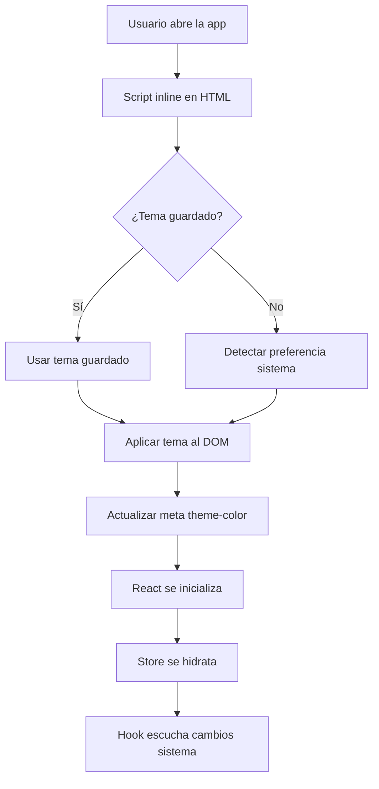

# Solución al Problema de Tema Mixto en Móviles

## Problema Identificado

La aplicación mostraba un comportamiento mixto entre modos light y dark en dispositivos móviles porque:

1. **Falta de detección automática**: No detectaba la preferencia `prefers-color-scheme` del sistema
2. **Inicialización tardía**: El tema se aplicaba después del renderizado inicial de React
3. **FOUC (Flash of Unstyled Content)**: Los usuarios veían un flash de contenido con tema incorrecto
4. **Meta theme-color estático**: El color de la barra de estado móvil no cambiaba dinámicamente

## Solución Implementada

### 1. Inicialización Inmediata del Tema

**Archivo: `index.html`**
- Script inline que se ejecuta antes de cargar React
- Detecta preferencia del sistema si no hay configuración guardada
- Aplica la clase `dark` inmediatamente al `<html>`
- Actualiza el `meta theme-color` para la barra de estado móvil

### 2. Utilidad de Gestión de Tema

**Archivo: `src/utils/themeInitializer.ts`**
- `detectSystemTheme()`: Detecta preferencia del sistema usando `matchMedia`
- `getInitialTheme()`: Obtiene tema inicial (guardado o sistema)
- `applyThemeToDOM()`: Aplica tema al DOM y actualiza meta tags
- `setupSystemThemeListener()`: Escucha cambios en preferencia del sistema

### 3. Hook para Sincronización con Sistema

**Archivo: `src/hooks/useSystemTheme.ts`**
- Escucha cambios en la preferencia del sistema
- Solo actualiza automáticamente si el usuario no ha establecido preferencia manual
- Mantiene sincronización entre sistema y aplicación

### 4. Actualización del Store de Configuraciones

**Archivo: `src/stores/settingsStore.ts`**
- Integra las utilidades de tema
- Callback `onRehydrateStorage` para aplicar tema después de cargar desde localStorage
- Método `setTheme` actualizado para usar las nuevas utilidades

## Flujo de Inicialización



## Beneficios de la Solución

### Para Usuarios Móviles
- **Sin FOUC**: No hay flash de contenido mal tematizado
- **Barra de estado consistente**: Color de barra cambia con el tema
- **Respuesta automática**: Sigue cambios del sistema automáticamente
- **Preferencias respetadas**: Mantiene elección manual del usuario

### Para Desarrolladores
- **Código limpio**: Separación clara de responsabilidades
- **Testeable**: Utilidades completamente testeadas
- **Mantenible**: Lógica centralizada en utilidades
- **Extensible**: Fácil agregar nuevos temas o comportamientos

## Archivos Modificados

1. **`index.html`**: Script de inicialización inmediata
2. **`src/main.tsx`**: Llamada a `initializeTheme()`
3. **`src/App.tsx`**: Integración del hook `useSystemTheme`
4. **`src/stores/settingsStore.ts`**: Uso de utilidades de tema
5. **`src/components/ui/Header.tsx`**: Simplificación (tema ya aplicado)

## Archivos Nuevos

1. **`src/utils/themeInitializer.ts`**: Utilidades de gestión de tema
2. **`src/hooks/useSystemTheme.ts`**: Hook para sincronización con sistema
3. **`tests/unit/utils/themeInitializer.test.ts`**: Tests unitarios
4. **`docs/theme-system-fix.md`**: Esta documentación

## Testing

Los tests cubren:
- Detección de preferencia del sistema
- Manejo de localStorage
- Aplicación de tema al DOM
- Configuración de listeners
- Manejo de errores y casos edge

Ejecutar tests:
```bash
npm run test:unit -- themeInitializer
```

## Compatibilidad

- **Navegadores modernos**: Soporte completo con `addEventListener`
- **Navegadores legacy**: Fallback con `addListener`
- **Sin JavaScript**: Fallback a tema light
- **Sin matchMedia**: Fallback a tema light

## Consideraciones de Rendimiento

- **Script inline mínimo**: Solo lógica esencial en HTML
- **Lazy loading**: Hook se carga solo cuando es necesario
- **Debounce implícito**: Los cambios de sistema no son frecuentes
- **Memoria mínima**: Cleanup automático de listeners

## Próximos Pasos Opcionales

1. **Tema automático**: Modo que sigue siempre al sistema
2. **Transiciones suaves**: Animaciones entre cambios de tema
3. **Más temas**: Soporte para temas personalizados
4. **Preferencias avanzadas**: Horarios automáticos de cambio